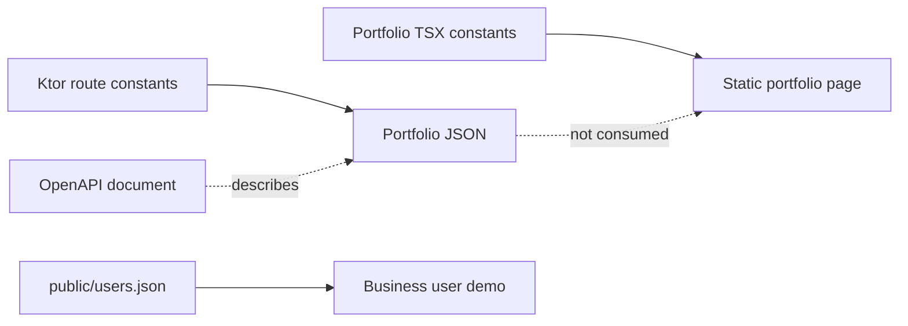
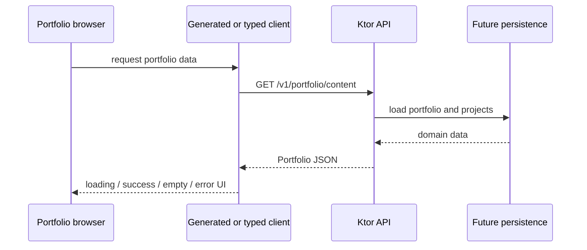

---
tags:
  - architecture
  - api
  - data-flow
status: current
reviewed: 2026-09-19
---

# API contract and data flow

The public contract is an OpenAPI 3.0.3 document at `../../packages/api-client/openapi.yaml`. Despite the directory name, there is no generated TypeScript client or package manifest in `packages/api-client` today.

## Contract surface

The contract declares one unauthenticated operation:

```text
GET /v1/portfolio/content
operationId: getPortfolio
200: Portfolio JSON
500: unexpected server error
```

The `Portfolio` and `PortfolioProject` schemas match the Kotlin response types in field names, required fields, and nullable/optional `description` behavior.

## Current data flow



There are currently three separate data islands:

1. Portfolio website content compiled into TSX.
2. API portfolio metadata constructed in `Api.kt`.
3. Business demo users stored as a static JSON asset.

No database, content-management system, generated API client, or shared TypeScript model connects these islands.

## Intended portfolio integration

Repository documentation reserves `VITE_API_BASE_URL=https://api.sedaia-designs.org`, CORS allows the portfolio domains, and the OpenAPI contract defines `getPortfolio`. Together they describe this future flow:



Only the Ktor endpoint and CORS portion are implemented. The client, frontend state handling, and persistence calls are not.

## Contract risks and checks

- The OpenAPI contract, Ktor route, tests, and deployment smoke checks use `/v1/portfolio/content` as the canonical portfolio-content endpoint.
- CI lints OpenAPI syntax/style but does not compare the document to Kotlin routes or validate live responses against its schemas.
- The API test asserts only that the serialized body contains the owner. It does not check every required field or project serialization.
- The contract declares HTTP 500 but the application has no configured StatusPages mapping for a stable error schema.
- Contract metadata says API version `1.0.0`, while the Gradle project is `1.0.0-SNAPSHOT`; these version domains are not currently coupled.

## Ownership recommendation

Treat the OpenAPI document as the public compatibility boundary. When the integration becomes active, changes should move together across:

1. OpenAPI schema and generated client,
2. Kotlin response models and route implementation,
3. API contract tests,
4. portfolio loading/error/empty UI,
5. deployment smoke verification.

This is an architectural recommendation, not a description of current automation.

## Source evidence

- Contract: `../../packages/api-client/openapi.yaml`
- Kotlin models: `../../apps/api/src/main/kotlin/org/sedaiadesign/api/models/response`
- Ktor route: `../../apps/api/src/main/kotlin/org/sedaiadesign/api/routes/Api.kt`
- Portfolio integration statement: `../../apps/portfolio/README.md`
- Current hard-coded portfolio content: `../../apps/portfolio/src/components/sections`
