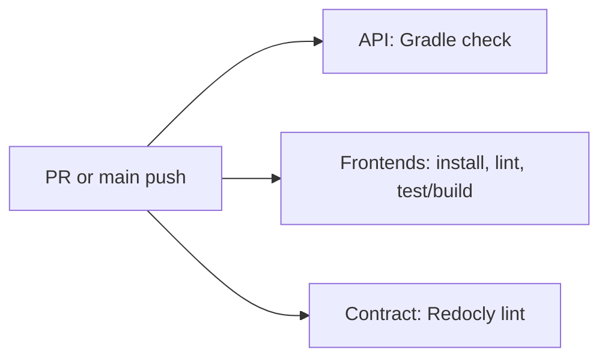
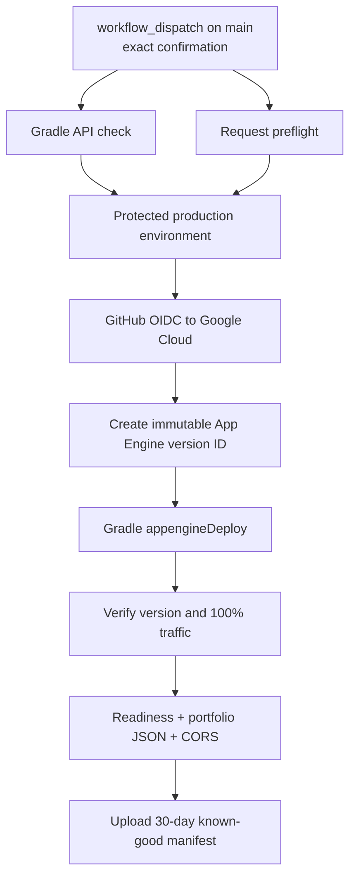

---
tags:
  - architecture
  - build
  - delivery
status: current
reviewed: 2026-09-19
---

# Build and delivery

The monorepo uses two build systems aligned to technology boundaries: Gradle for the JVM API and pnpm for frontend workspaces plus contract tooling.

## Build ownership

| Scope | Toolchain | Root control files |
| --- | --- | --- |
| API | Gradle wrapper, Kotlin 2.4, Java 21 | `../../settings.gradle.kts`, `build.gradle.kts`, `gradle/libs.versions.toml` |
| Frontends | pnpm 10.22, Node 22.18, Vite | `../../package.json`, `pnpm-workspace.yaml`, `pnpm-lock.yaml` |
| API contract | Redocly CLI through pnpm | `../../packages/api-client/openapi.yaml` |

The pnpm workspace includes `apps/*` and `packages/*`. Recursive root scripts run only scripts that each package exposes. Gradle includes only `:apps:api`.

## Continuous integration

GitHub Actions `CI` runs on pull requests and pushes to `main`:

The three jobs currently run for every triggering change; the checked-in GitHub workflow has no path filters. The root README's description of path-filtered GitLab CI refers to a `.gitlab-ci.yml` that is not present in the active repository tree, so it should not be treated as the current CI implementation.

## API deployment

API production deployment is a manual GitHub workflow:

The target is App Engine Standard service `default` in project `sedaia-web-platform-api-508804`. The version ID combines GitHub run ID, attempt, and a short commit SHA. The workflow is serialized by `production-api` and does not cancel a release already in progress.

The App Engine Gradle plugin stages the fat JAR, while `app.yaml` selects Java 21 and launches `api-all.jar`.

## API rollback

Rollback is also manual and protected. It accepts a successful deployment run ID, reason, and exact confirmation. The workflow:

1. downloads that run's retained release artifact;
2. asks the GitHub API to prove it came from a successful manual deploy on `main`;
3. validates manifest project, service, commit, version, checks, and traffic;
4. confirms the App Engine version still exists;
5. moves all traffic to that existing version without rebuilding;
6. reruns smoke checks and uploads before/after evidence.

This makes an immutable App Engine version—not a container image or source ref—the API rollback unit.

## Frontend delivery

Each frontend is designed as an independent Vercel project rooted at its own application directory. Both configs declare a frozen install, local `pnpm build`, and `dist/client` output. Automatic Git deployments are disabled in both checked-in `vercel.json` files.

The repository does not include a GitHub Actions frontend deployment workflow. Actual promotion of frontend builds is therefore outside the active automation captured here. The documented rollback method is redeploying the last known-good Vercel deployment.

## Legacy/alternate container path

The root `../../Dockerfile` builds the API fat JAR and packages it in a Java 21 Alpine runtime with a Cloud Run comment. No active GitHub workflow consumes this Dockerfile, and current operations target App Engine Standard. Treat it as an unconnected legacy/alternate artifact until it is either restored to an active pipeline or removed.

## Source evidence

- CI: `../../.github/workflows/ci.yml`
- Deploy: `../../.github/workflows/deploy-api.yml`
- Rollback: `../../.github/workflows/rollback-api.yml`
- Release scripts: `../../scripts`
- API packaging: `../../apps/api/build.gradle.kts`, `apps/api/src/main/appengine/app.yaml`
- Frontend delivery: both `vercel.json` files
- Alternate image build: `../../Dockerfile`
