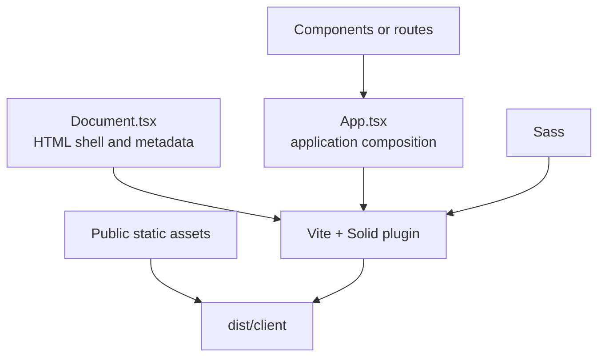

---
tags:
  - architecture
  - frontend
  - solidjs
status: current
reviewed: 2026-09-19
---

# Frontend applications

Both sites use the SolidJS 2 prerelease stack with Vite's turnkey client mode. Vite prerenders the document shell and emits a static `dist/client`; browser JavaScript then activates interactive behavior. Neither application runs a production Node server.

## Shared frontend shape



Both applications target modern browsers with `build.target = "esnext"` and prevent image inlining with `assetsInlineLimit = 0`.

## Portfolio application

The portfolio is a single composed page with no router. `App.tsx` owns page-level composition and includes navigation, header, background, technical expertise, software projects, render projects, and contact content.

### Interaction model

- A `blur` signal switches between normal content and the background render collage.
- An `IntersectionObserver` defers collage loading until the main element intersects; it falls back to immediate loading when the browser lacks that API.
- Each render card owns a `modalOpen` signal.
- `ImageModal` uses a portal to render a modal overlay outside the card hierarchy.
- `IconBundle` maps semantic icon names to SVG fragment references in `public/images/vectors`.

Most domain content is currently authored directly in TSX. Render metadata is a module-local array, and a TODO explicitly anticipates moving it to an API/database later.

`VITE_API_BASE_URL` is documented for production, but no source code reads it and no portfolio `fetch()` exists. The portfolio therefore has **no current runtime dependency on the API**.

## Business application

The business site is a routed static SPA generated from `src/routes`:

```text
/
/users/:id
/* (catch-all)
```

`router.ts` turns the virtual file route list into a typed Solid Router instance and exports typed path helpers. `App.tsx` supplies global navigation and a `Loading` boundary.

The `/users/:id` example uses a router query and route preload to fetch same-origin `/users.json`; the data is a static public file. The catch-all route calls `httpStatus(404)`, but the source notes that browser-only mode makes this a no-op. Because Vercel rewrites paths to `index.html`, unknown production paths are expected to receive the SPA document at the transport layer and show the not-found UI in the client.

The checked-in business content, metadata, counter, and users are Solid starter/demo material. The route architecture is real; the public business information architecture is not yet implemented.

## Key differences

| Concern | Portfolio | Business |
| --- | --- | --- |
| Navigation | In-page/external links | Typed client-side router |
| Content maturity | Domain-specific portfolio content | Starter/demo content |
| Data loading | None | Same-origin static JSON example |
| Main interaction | Collage and image modal | Counter and user routes |
| Vercel fallback rewrite | No | Yes, all paths to `index.html` |
| Automated tests | None declared | Vitest component test for counter |

## Source evidence

- Portfolio composition: `../../apps/portfolio/src/App.tsx`, `apps/portfolio/src/components/`
- Portfolio shell/config: `../../apps/portfolio/src/Document.tsx`, `apps/portfolio/vite.config.ts`
- Business composition and router: `../../apps/business/src/App.tsx`, `apps/business/src/router.ts`, `apps/business/src/routes/`
- Business static example data: `../../apps/business/public/users.json`
- Hosting configuration: both applications' `vercel.json`
