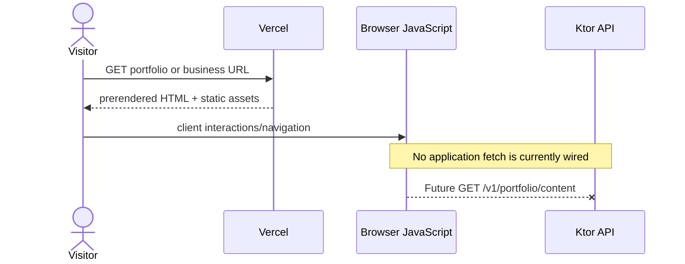

---
tags:
  - architecture
  - runtime
status: current
reviewed: 2026-09-20
---

# Runtime topology

The repository produces three independent deployables. There is no shared application server and no active runtime database.

## Deployable units

| Unit | Runtime/build stack | Artifact | Host |
| --- | --- | --- | --- |
| Portfolio | SolidJS 2, TypeScript, Vite, Sass | `../../apps/portfolio/dist/client` | Vercel |
| Business site | SolidJS 2, Solid Router, TypeScript, Vite, Sass | `../../apps/business/dist/client` | Vercel |
| Public API | Kotlin/JVM 21, Ktor/Netty | Fat JAR staged as `api-all.jar` | App Engine Standard Java 21 |

## Browser request paths



The portfolio has no router. It composes one page from section components and uses fine-grained signals for the collage state and image modal. The business site has client-side file-system routes and a catch-all rewrite to `index.html`.

## API request path

```mermaid
flowchart LR
    request[HTTP request] --> netty[Netty EngineMain]
    netty --> module[Application.module]
    module --> plugins[CORS + JSON + health]
    module --> routing[/v1 route tree]
    routing --> root[GET /v1/]
    routing --> portfolio[GET /v1/portfolio/content]
    plugins --> live[GET /health/live]
    plugins --> ready[GET /health/ready]
```

`EngineMain` reads `application.yaml`, which points to `org.sedaiadesign.api.ModuleKt.module` and binds to `$PORT` with `8080` as the local default. `module()` installs plugins before registering routes.

## Network and dependency characteristics

- The sites can load without the API because all visible content is bundled or stored in public assets.
- The business user example fetches `/users.json` from the same Vercel origin; it does not call the Ktor API.
- The API has no configured downstream service. Portfolio JSON is constructed in the route handler.
- Health responses report process/plugin availability, not database or external-service readiness.
- Static assets live under each application's `public/` directory and are emitted with the site build.

## Hosting behavior

- Both Vercel configurations use a frozen pnpm install and publish `dist/client`.
- Business rewrites all unmatched paths to `/index.html` to support client-side routing.
- Portfolio has no equivalent rewrite because it exposes a single document rather than route paths.
- Both Vercel configurations set `git.deploymentEnabled` to `false`; automatic Git-based Vercel deployment is therefore disabled in the checked-in configuration.

## Source evidence

- API startup: `../../apps/api/src/main/kotlin/org/sedaiadesign/api/main.kt`, `apps/api/src/main/kotlin/org/sedaiadesign/api/Module.kt`, `apps/api/src/main/resources/application.yaml`
- Frontend Vite configuration: `../../apps/portfolio/vite.config.ts`, `apps/business/vite.config.ts`
- Vercel behavior: `../../apps/portfolio/vercel.json`, `apps/business/vercel.json`
- Browser code: `../../apps/portfolio/src/App.tsx`, `apps/business/src/App.tsx`, `apps/business/src/router.ts`
