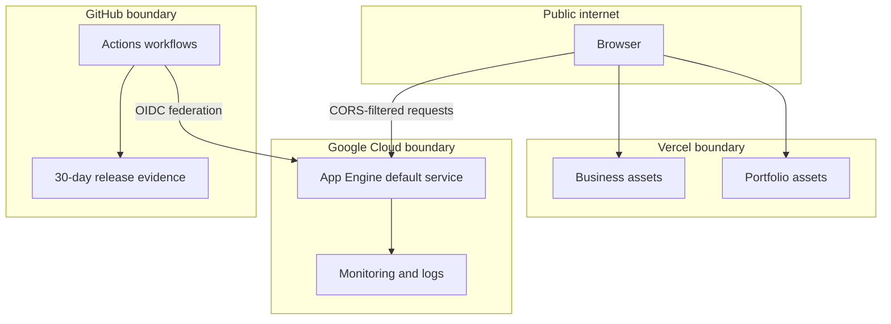

---
tags:
  - architecture
  - context
status: current
reviewed: 2026-09-20
---

# System context

[[Architecture Home|Sedaia web platform]] presents two public web identities backed by one repository and a separate public API service.

## Actors and external systems

| Element | Role | Boundary |
| --- | --- | --- |
| Portfolio visitor | Reads professional, software, and artwork content | Public internet |
| Business-site visitor | Navigates the business SPA | Public internet |
| Release operator | Initiates protected API deploys and rollbacks | GitHub production environment |
| Vercel | Builds and serves both static frontends as separate projects | External hosting platform |
| Google App Engine Standard | Runs the Ktor API's `default` service | External compute platform |
| GitHub Actions | Validates all units and orchestrates API production changes | CI/CD control plane |
| Google Cloud Monitoring and Logging | Intended API telemetry and alerting system | External operations platform |

## Public endpoints

| Public identity | Deployable | Current behavior |
| --- | --- | --- |
| `sakura-sedaia.com` and `www.sakura-sedaia.com` | Portfolio | Static, single-page portfolio with client-side interactions |
| `sedaia-designs.org` and `www.sedaia-designs.org` | Business site | Static SPA with client-side file-system routes |
| `api.sedaia-designs.org` | API | Declared OpenAPI server and intended canonical API origin |
| `sedaia-web-platform-api-508804.uc.r.appspot.com` | API | Address used by deployment verification and uptime guidance |

The repository does not establish DNS mappings, so domain-to-provider bindings are architectural configuration assumptions rather than facts provable from source alone.

## Trust boundaries

The most significant privileged boundary is GitHub Actions to Google Cloud. Production workflows request `id-token: write` and authenticate through Workload Identity Federation; no long-lived cloud credential is declared in the repository.

## System-level constraints

- The frontends are browser-delivered static assets. They cannot safely hold secrets.
- API browser access is restricted by an allowlist, but CORS is not authentication and does not stop non-browser clients.
- Production API changes require the `main` branch, an exact confirmation string, the GitHub `production` environment, and the shared `production-api` concurrency group.
- The two frontends and API can fail or roll back independently.

## Source evidence

- Domain and ownership declarations: `../../README.md`
- CORS allowlist: `../../apps/api/src/main/kotlin/org/sedaiadesign/api/lib/plugins/CorsPlugin.kt`
- Deployment identity and public verification URL: `../../.github/workflows/deploy-api.yml`
- Frontend hosting: `../../apps/portfolio/vercel.json`, `apps/business/vercel.json`
