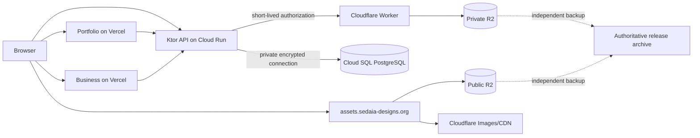

# Sedaia Platform Buildout

## Objective

Deliver five production surfaces from the current monorepo state: `https://sakura-sedaia.com`, `https://assets.sedaia-designs.org`, the approved meaning of `sql.sedaia-designs.org`, `https://api.sedaia-designs.org`, and `https://sedaia-designs.org`. Production acceptance requires reviewed source, controlled publication, DNS and TLS, least-privilege boundaries, health and monitoring, tested recovery, named ownership, current documentation, and retained evidence. This plan authorizes planning only; each execution phase requires normal review and change authorization.

## Authority and current-state summary

This plan is the master buildout authority. [[../GCloudCloudRunRemediation/Orchestration|Google Cloud Run Remediation]] remains independently authoritative for the existing API deployment path; this plan depends on its gates and must not duplicate, relax, or reorder them. [[../MonorepoBuildout/Orchestration|Monorepo Buildout]] is superseded as an executable plan, with every phase mapped below and in [[Phase 00 - Audit and Authority Reconciliation]]. Archived plans under `../../Archives/Plans/` are evidence only and must not be executed.

Repository evidence as of 2026-09-21 shows a functioning Ktor API and production-oriented Cloud Run pipeline, a substantially built portfolio that now contains a runtime API consumer, a demo-level business application, a validated OpenAPI document without a generated client, placeholder CDN and SQL directories, no PostgreSQL driver or Flyway integration, and no R2 or Worker implementation. Both Vercel configurations disable Git deployment. Hosted API evidence exists in the remediation notes, but alert delivery and the remediation final gate remain incomplete; no checked-in configuration proves the other four production surfaces are published.

| Capability                                               | Classification                                                                                 | Evidence                                                                                                                                                                                                                         |
| -------------------------------------------------------- | ---------------------------------------------------------------------------------------------- | -------------------------------------------------------------------------------------------------------------------------------------------------------------------------------------------------------------------------------- |
| Ktor metadata, portfolio, liveness, and readiness routes | Implemented; production contract deployed but remediation acceptance remains open              | `apps/api/src/main/kotlin/org/sedaiadesign/api/routes/Api.kt`, `apps/api/src/main/kotlin/org/sedaiadesign/api/lib/plugins/HealthPlugin.kt`, commit `50f34f9`, and [[../GCloudCloudRunRemediation/Phase 06 - Final Verification]] |
| Safe Cloud Run release and rollback automation           | Implemented in repository and partly hosted-proven; final remediation gates pending            | `cloudbuild.yaml`, `scripts/deploy-cloud-run-safe.sh`, `.github/workflows/rollback-api.yml`, `operations/ROLLBACK_AND_OBSERVABILITY.md`, commits `a583ec4` and `7e89998`                                                         |
| Portfolio application                                    | Substantially implemented; API integration is present but publication behavior is not accepted | `apps/portfolio/src/App.tsx`, `apps/portfolio/src/utils/asyncUtils.ts`, commit `e4642a3`, and `apps/portfolio/vercel.json`                                                                                                       |
| Business application                                     | Scaffolding only                                                                               | `apps/business/src/routes/index.tsx` still renders the Solid starter counter                                                                                                                                                     |
| API client package                                       | Contract only; generation absent                                                               | `packages/api-client/openapi.yaml` and no generated source files                                                                                                                                                                 |
| SQL data layer                                           | Scaffolding only                                                                               | `apps/sql/placeholder.md`; API declares Exposed R2DBC plus H2 but has no PostgreSQL connection, repositories, schema, or migrations in `apps/api/build.gradle.kts`                                                               |
| Asset/CDN layer                                          | Scaffolding only                                                                               | `apps/cdn/placeholder.md`; site-specific assets remain in `apps/portfolio/public/`                                                                                                                                               |
| Frontend hosting                                         | Configuration exists; hosted state must be proven                                              | `apps/portfolio/vercel.json` and `apps/business/vercel.json` both set `git.deploymentEnabled` to `false`                                                                                                                         |
| Production observability                                 | Partial                                                                                        | Templates under `operations/monitoring/`; notification channel and four hosted policies remain pending in `operations/ROLLBACK_AND_OBSERVABILITY.md`                                                                             |

## Old Monorepo Buildout disposition

| Old phase | Disposition | Transfer and evidence |
| --- | --- | --- |
| Phase 00 - Baseline Audit | Completed and evidenced, but its database and API-consumer conclusions are now stale | Workspace/API/frontend findings remain reusable; `apps/sql` and `apps/cdn` placeholders were added in commit `e24f7fa`, and the portfolio consumer was added in commit `e4642a3`. Re-audited in [[Phase 00 - Audit and Authority Reconciliation]]. |
| Phase 01 - Complete Application Surfaces | Superseded and partly deferred | Docs/blog are not among the five required surfaces and stay deferred; business completion moves to [[Phase 09 - Business Frontend Completion and Gate]]. |
| Phase 02 - Complete Shared Packages | Partially complete | OpenAPI linting exists; generated client remains an approved decision and is handled in [[Phase 07 - Ktor API and Shared Contract]]. Speculative design tokens/config remain deferred until two consumers exist. |
| Phase 03 - Integrate Portfolio API | Partially complete | Runtime fetch exists at `apps/portfolio/src/App.tsx`; origin, failure states, contract, CORS, accessibility, and hosted behavior remain in [[Phase 08 - Portfolio Integration and Publication Gate]]. |
| Phase 04 - Establish Shared Asset Delivery | Still valid and now required | Provider and use case are no longer deferred: R2/Cloudflare is provisional and must pass decisions and implementation in Phases 05–06. |
| Phase 05 - Validate Independent Delivery | Partially complete and partly superseded | API delivery belongs solely to Cloud Run remediation; frontend, SQL migration, Worker/CDN, and isolation proof move to Phases 10 and 13. Historical App Engine instructions must not be executed. |
| Phase 06 - Final Verification | Still valid but insufficient | Replaced by the broader production acceptance in [[Phase 14 - Final Production Verification]]. |

The item-level audit and citations are in [[Phase 00 - Audit and Authority Reconciliation]].

## Target architecture

PostgreSQL on Cloud SQL is the structured-data system of record for catalogs, products, releases, compatibility, licenses, checksums, object keys, and publication state. R2 holds binaries and media in separate public and private/staging buckets; PostgreSQL never stores binaries. Ktor owns metadata APIs, database transactions, and restricted-download authorization. Public immutable objects are served through `assets.sedaia-designs.org`; restricted objects are returned by a Cloudflare Worker with an R2 binding after a short-lived, audience-bound authorization decision. Cloudflare Images transformations are used only after the cost and URL policy are approved. Portfolio and Business remain independently deployed static SolidJS applications on Vercel. Cloud Run remains the Ktor runtime, subject to the unmodified remediation gates.

## Domain and service ownership

| Surface | Owner | Provider | Source | Deployment authority | DNS/TLS owner | Publication gate |
| --- | --- | --- | --- | --- | --- | --- |
| `sakura-sedaia.com` | Portfolio maintainer | Vercel | `apps/portfolio` | Approved manual/staged Vercel promotion until automation is restored | Named domain operator; Vercel certificate | Phase 08, then Phases 13–14 |
| `assets.sedaia-designs.org` | Asset platform owner | Cloudflare R2/CDN/Images and Worker where needed | `apps/cdn` plus infrastructure configuration selected in Phase 02 | Reviewed asset/Worker pipeline | Named Cloudflare zone owner; Cloudflare certificate | Phases 05–06, then Phases 13–14 |
| `sql.sedaia-designs.org` | Data platform owner | Recommended: no public service; private DNS label only if required | `apps/sql` plus Cloud SQL configuration | Migration authority, not a public deployer | Private DNS owner or reserved label; no public TLS unless an HTTPS admin service is separately approved | Blocking decision in Phase 01; Phases 03–04 and 14 |
| `api.sedaia-designs.org` | API maintainer | Google Cloud Run | `apps/api`, root Docker/Cloud Build/scripts | Regional `sedaia-api-main` trigger; protected rollback workflow | Named DNS owner; Google frontend certificate/path already selected | Cloud Run remediation plus Phases 07, 13–14 |
| `sedaia-designs.org` | Business-site owner | Vercel | `apps/business` | Approved manual/staged Vercel promotion until policy is accepted | Named domain operator; Vercel certificate | Phase 09, then Phases 13–14 |

## Trust boundaries

- Browsers are untrusted and never receive database credentials, R2 write credentials, service-account keys, or unrestricted private-object URLs.
- Cloud Run uses a dedicated runtime identity and private network path to Cloud SQL; deployment, migration, runtime, backup, and break-glass identities remain separate.
- The public R2 bucket contains only approved immutable public objects. Private/staging buckets are not exposed through `r2.dev` or an unauthenticated custom domain.
- Short-lived download grants are bearer capabilities with narrow object, method, audience where practical, and expiry scope. Worker logs must not retain tokens.
- Publication state changes are transactional metadata operations; object upload alone never makes a release public.
- CI identities can validate without production credentials. Production mutation requires protected environments, reviewed source, serialized execution, and retained evidence.

## Blocking decisions

| Decision | Recommendation | Alternatives and consequence | Approval owner / status |
| --- | --- | --- | --- |
| Meaning of `sql.sedaia-designs.org` | No public PostgreSQL endpoint. Reserve as an architectural label; create private DNS only if an approved VPC/PSC consumer needs stable naming. | Private DNS is acceptable; an authenticated HTTPS admin/observability service is possible but adds a deployable and attack surface; a database gateway is unjustified for release one. Public port 5432 is rejected. | Platform/security owner; awaiting approval and blocks Phase 03 production design |
| Cloud SQL connectivity | Private IP with Direct VPC egress where supported, same region as Cloud Run; encrypted connection and IAM database authentication evaluated with pooling | Serverless VPC Access connector is the fallback; Cloud SQL connector over public IP is possible but conflicts with private-by-default preference. | Platform owner; awaiting cost/capability approval |
| Availability, RPO, and RTO | First release: regional HA if budget permits, PITR enabled, daily automated backups, quarterly restore drill; set explicit RPO/RTO before provisioning | Zonal instance reduces cost but increases recovery exposure; multi-region failover is future scope. | Product/operations owner; awaiting numeric RPO/RTO and budget |
| R2 account/bucket layout | Separate production-public, production-private, staging, and backup authority outside serving buckets | Fewer buckets weaken policy isolation; Cloudflare Images storage instead of R2 originals changes cost and backup mechanics. | Asset/platform owner; awaiting names, region/jurisdiction, budget |
| Restricted download protocol | Ktor issues a short-lived signed authorization consumed by a Worker with private R2 binding | R2 S3 presigned URLs cannot use a custom domain; direct API proxying increases Cloud Run egress and load. | Security/product owner; awaiting entitlement requirements |
| API client | Generate a pinned TypeScript client from OpenAPI if both frontends consume the API; otherwise retain a small validated adapter | Handwritten clients are simpler initially but need explicit schema tests. | Frontend/API owners; decide before Phase 07 exit |
| Product catalog and business content | Approve minimum launch entities, routes, copy, legal links, download policy, and empty-state behavior | CMS, accounts, payments, and marketplace remain deferred. | Product owner; awaiting requirements |
| Frontend promotion policy | Keep Git deployment disabled; use staged/manual promotion with evidence through launch | Restore automation only after the relevant gate, rollback drill, environment separation, and approval controls pass. | Site owners; awaiting approval |

## Scope tiers

Required for first production release: five-surface meaning and ownership, private Cloud SQL, schema/migrations, Exposed persistence, public/private R2 separation, immutable release assets, public and restricted delivery, API contracts, finished frontends, DNS/TLS, CI, security controls, monitoring, backups, rollback, documentation, and end-to-end proof.

Required shortly after launch: tune alerts and database pools from real traffic, complete the second restore/rollback exercise, verify cost budgets and lifecycle behavior, review access and keys, refine image variants, and decide whether frontend automatic deployment may be restored.

Optional future capability: CMS, user accounts, paid downloads, generalized plugin marketplace, advanced product analytics, multi-region active failover, search, recommendations, and more elaborate media workflows.

Explicitly deferred pending requirements: docs/blog applications, cross-site design-token packages, customer identity/entitlements beyond the minimum restricted-download policy, payments, author self-service uploads, and direct administrative UI.

## Phase order

1. [[Phase 00 - Audit and Authority Reconciliation]]
2. [[Phase 01 - Product and Architecture Decisions]]
3. [[Phase 02 - Environment Domain and Trust Design]]
4. [[Phase 03 - Cloud SQL Provisioning and Recovery Baseline]]
5. [[Phase 04 - Schema Flyway and Exposed Persistence]]
6. [[Phase 05 - R2 Asset Supply Chain]]
7. [[Phase 06 - CDN Images and Download Delivery]]
8. [[Phase 07 - Ktor API and Shared Contract]]
9. [[Phase 08 - Portfolio Integration and Publication Gate]]
10. [[Phase 09 - Business Frontend Completion and Gate]]
11. [[Phase 10 - CI Environments Secrets and Supply Chain]]
12. [[Phase 11 - Observability Capacity and Cost Controls]]
13. [[Phase 12 - Backup Disaster Recovery and Runbooks]]
14. [[Phase 13 - Staged Deployment and Publication]]
15. [[Phase 14 - Final Production Verification]]

## Dependencies and parallel work

| Workstream | May run in parallel after | Must converge before |
| --- | --- | --- |
| Business product/content implementation | Phase 01 decisions | Phase 09 gate |
| Portfolio UX/API adapter | Phase 01 contract/fallback decisions | Phase 08 gate |
| Cloud SQL provisioning design and R2 account design | Phase 02 | Persistence/assets integration in Phases 04–07 |
| Schema/migrations and object-key conventions | Phase 01 entity decisions | API and publication workflow |
| Cloud Run remediation | Immediately, under its own authority | API production publication in Phase 13 |
| Monitoring templates/runbooks | Phase 02 ownership decisions | Phase 13 publication |
| Frontend accessibility review | Stable feature routes in Phases 08–09 | Frontend publication |

No production publication begins until Phases 01–12 have passed for the affected dependency chain. Database expand migrations precede compatible API deployment; object upload and scanning precede metadata publication; API compatibility precedes frontend promotion; destructive contract/schema cleanup follows the observation window.

## Deployment and publication sequence

1. Freeze an approved release candidate and record commit/digests, change owner, incident contacts, rollback targets, and maintenance window.
2. Validate CI from locked inputs and build immutable API, Worker, frontend, migration, and asset artifacts without production mutation.
3. Back up Cloud SQL and verify PITR/restore readiness; validate Flyway, then apply backward-compatible expand migrations with a dedicated migration identity.
4. Upload quarantined assets, verify size/MIME/signature/checksum, complete scanning/signing/notarization gates, copy immutable objects to their approved bucket/key, and create unpublished metadata rows.
5. Deploy the backward-compatible API through the exact Cloud Run remediation process and verify generated/tagged/canonical endpoints before traffic.
6. Deploy and verify the Worker/CDN configuration without exposing private buckets; validate public and restricted flows, caching, CORS, range requests, filenames, and expiry.
7. Publish metadata transactionally only after every referenced object and checksum passes; never overwrite an immutable release key.
8. Create staged Vercel production builds, verify environment variables and API behavior, then manually promote Portfolio and Business independently.
9. Apply DNS/TLS changes only after provider verification succeeds; retain before/after records, certificate state, TTLs, and rollback values.
10. Run Phase 14 end-to-end acceptance, observe the agreed window, then schedule contract migrations/cleanup as later roll-forward work.

## Definition of done

Every phase exit criterion passes; all blocking decisions are approved; five surfaces match the acceptance matrix; Cloud Run remediation is complete without weakened gates; PostgreSQL has no public ingress; every public/restricted asset is traceable from metadata to immutable object and checksum; both frontends pass WCAG 2.2 AA-oriented manual and automated acceptance; alerts reach named owners; backups and rollbacks are drilled; costs and abuse limits are active; current runbooks identify authority and recovery paths; and retained evidence can reproduce which source, schema, assets, configuration, and hosted revisions were accepted.

## Residual risks to carry explicitly

- R2 is not by itself an independent backup; loss/corruption recovery depends on the separate authoritative archive selected in Phase 05.
- Cross-provider operation creates Cloudflare, Google Cloud, Vercel, DNS, and repository ownership dependencies; named access-review and offboarding procedures are mandatory.
- Cloud SQL HA, PITR retention, Cloudflare Images, and Vercel protection features have cost/plan consequences that cannot be accepted by repository changes.
- Browser-held restricted-download URLs remain bearer capabilities until expiry; short TTL, narrow scope, no token logging, and replay/abuse controls reduce but do not eliminate risk.
- Schema rollback is not equivalent to data recovery; destructive changes require expand/contract, restore proof, and roll-forward preference.
- Current architecture notes contain stale App Engine and “no API fetch” statements; Phase 00 requires reconciliation before operators rely on them.

## Current official documentation constraints

- Google recommends placing Cloud SQL in the same region as Cloud Run; private-IP connections require Direct VPC egress or Serverless VPC Access on the connected VPC. [Connect from Cloud Run](https://docs.cloud.google.com/sql/docs/postgres/connect-run)
- IAM database authentication requires SSL, uses temporary tokens, has login quotas, and benefits from persistent connection pooling. [Cloud SQL IAM authentication](https://docs.cloud.google.com/sql/docs/postgres/iam-authentication)
- HA preserves the instance connection target through failover, while PITR restores to a new instance and must be operationally rehearsed. [Cloud SQL high availability](https://docs.cloud.google.com/sql/docs/postgres/high-availability) and [restore overview](https://docs.cloud.google.com/sql/docs/postgres/backup-recovery/restore)
- R2 buckets are private by default; production caching/WAF controls require a custom domain, while `r2.dev` is a rate-limited development endpoint. [R2 public buckets](https://developers.cloudflare.com/r2/buckets/public-buckets/) and [R2 caching](https://developers.cloudflare.com/cache/interaction-cloudflare-products/r2/)
- R2 presigned URLs are bearer tokens and do not work on custom domains, supporting the Worker-binding recommendation for restricted custom-domain delivery. [R2 presigned URLs](https://developers.cloudflare.com/r2/api/s3/presigned-urls/)
- Cached R2 deletes, overwrites, and previous 404s may persist until expiry or purge; immutable keys avoid most invalidation hazards. [R2 consistency](https://developers.cloudflare.com/r2/reference/consistency/)
- R2 lifecycle rules can expire or transition objects and must never be applied to authoritative binaries without verified backup/retention policy. [R2 object lifecycles](https://developers.cloudflare.com/r2/buckets/object-lifecycles/)
- Cloudflare Images can transform R2-hosted originals and supply responsive variants/modern formats, but transformation counts and plan limits require a budget. [Images overview](https://developers.cloudflare.com/images/) and [responsive images](https://developers.cloudflare.com/images/optimization/make-responsive-images/)
- Vercel can stage production builds without assigning custom domains and later promote or instantly roll back an existing deployment; environment values are environment-scoped. [Promoting deployments](https://vercel.com/docs/deployments/promoting-a-deployment) and [environment variables](https://vercel.com/docs/environment-variables)
- Exposed R2DBC work must run inside suspend transactions; only one transport family should be selected, and migration generation does not replace Flyway as the approved history authority. [Exposed transactions](https://www.jetbrains.com/help/exposed/transactions.html), [dependencies](https://www.jetbrains.com/help/exposed/adding-dependencies.html), and [migrations](https://www.jetbrains.com/help/exposed/migrations.html)
- Flyway validation detects missing, changed, or out-of-order migration history; undo scripts do not replace backup/restore, so production favors compatible forward migrations and explicit recovery. [Flyway validate](https://documentation.red-gate.com/flyway/reference/commands/validate) and [rollback strategy](https://documentation.red-gate.com/fd/implementing-a-roll-back-strategy-138347142.html)

## Final production-acceptance matrix

| Surface | Component / host / source | Authority and DNS/TLS owner | Health and verification | Monitoring | Rollback | Backup/recovery | Required publication evidence |
| --- | --- | --- | --- | --- | --- | --- | --- |
| `https://sakura-sedaia.com` | Portfolio; Vercel; `apps/portfolio` | Manual/staged Vercel promotion until approved automation; named domain operator/Vercel TLS | HTTP/TLS, critical routes, API success/error/empty/offline behavior, CORS, responsive and WCAG review | Vercel logs/analytics as approved plus external uptime and API-dependency alert | Reassign domain to known-good Vercel deployment; static fallback remains usable | Git source, reproducible build, retained deployment metadata and environment inventory | Commit, build/deployment ID, environment hash/inventory, domain/certificate proof, test/a11y results, rollback drill |
| `https://assets.sedaia-designs.org` | Public assets plus authorized Worker paths; Cloudflare; `apps/cdn` | Protected pipeline; named Cloudflare/DNS owner and Cloudflare TLS | HEAD/GET, checksum, MIME, disposition, range, cache, CORS, immutable key, restricted expiry/replay tests | Worker/R2/Cache analytics, error/rate alerts, external probes for representative objects | Roll back Worker/config; republish metadata to prior immutable key; purge only when necessary | Independent authoritative artifact/archive plus inventory/checksum restore drill | Worker/version/config ID, bucket policy, DNS/cert proof, object manifest, scans/signatures, cache and restore tests |
| `sql.sedaia-designs.org` | Recommended private label/reserved identifier for Cloud SQL; `apps/sql` | Dedicated migration/data owners; private DNS owner or no public record | No public resolution/port; private authenticated encrypted connection; migration/schema checks; restore query | Cloud SQL metrics/logs, connection saturation, storage, replication/backup/PITR alerts | Application roll-forward, compatible schema procedure, PITR/restore to new instance | Automated backups, PITR, export where justified, documented restore and ownership | Decision record, DNS non-exposure proof, instance/config IDs, schema version, backup/PITR and restore drill evidence |
| `https://api.sedaia-designs.org` | Ktor; Cloud Run; `apps/api` | `sedaia-api-main` and protected rollback; named DNS owner/Google TLS path | Remediation verifier plus persistence, error contract, auth/rate, dependency-readiness checks | Existing four-policy remediation baseline plus DB/downstream dashboards and alerts | Verified immutable Cloud Run revision/digest rollback; database compatibility guard | Source/image/evidence retention; Cloud SQL recovery; no container-local state | Cloud Build ID, commit, digest, revision, schema version, canonical TLS/contract results, alerts and rollback drill |
| `https://sedaia-designs.org` | Business frontend; Vercel; `apps/business` | Manual/staged Vercel promotion until approved automation; named domain operator/Vercel TLS | HTTP/TLS, routes/404, catalog/download flows, SEO metadata, responsive and WCAG review | Vercel telemetry as approved, external uptime, browser/API error monitoring | Reassign domain to known-good Vercel deployment | Git source, reproducible build, retained deployment metadata and environment inventory | Product approval, commit/deployment ID, domain/cert proof, E2E/a11y results, download proof, rollback drill |
